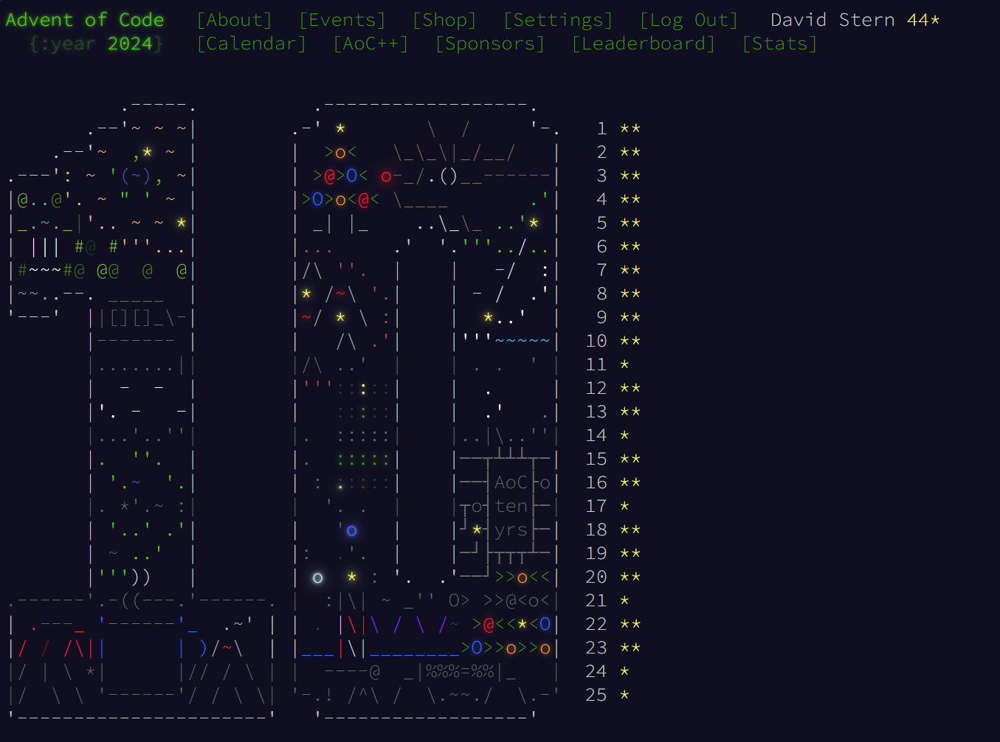

## Progress Summary
Just like last year, I am working through the 2024 [Advent of Code](https://adventofcode.com/2024) problems. I currently have `35` stars. Each day's solutions are found in the `/advent_solutions` folder under the day in question. As requested by the creator of the problems, I do not provide the input text, only the code solutions. To run a certain solution, ensure that the correct input text is placed in an `input.txt` file. Just like last year, solutions implement the following trait: 
```rust
pub trait SolveAdvent {
    ///How to solve part1 of the days puzzle.
    fn solve_part1(path_to_file: &str) -> anyhow::Result<()>;
    ///How to solve part2 of the days puzzle.
    fn solve_part2(path_to_file: &str) -> anyhow::Result<()>;
}
```

